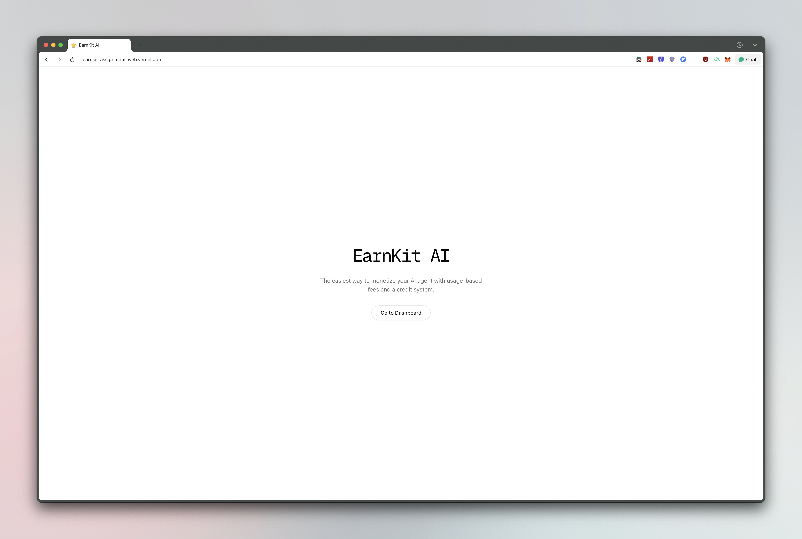
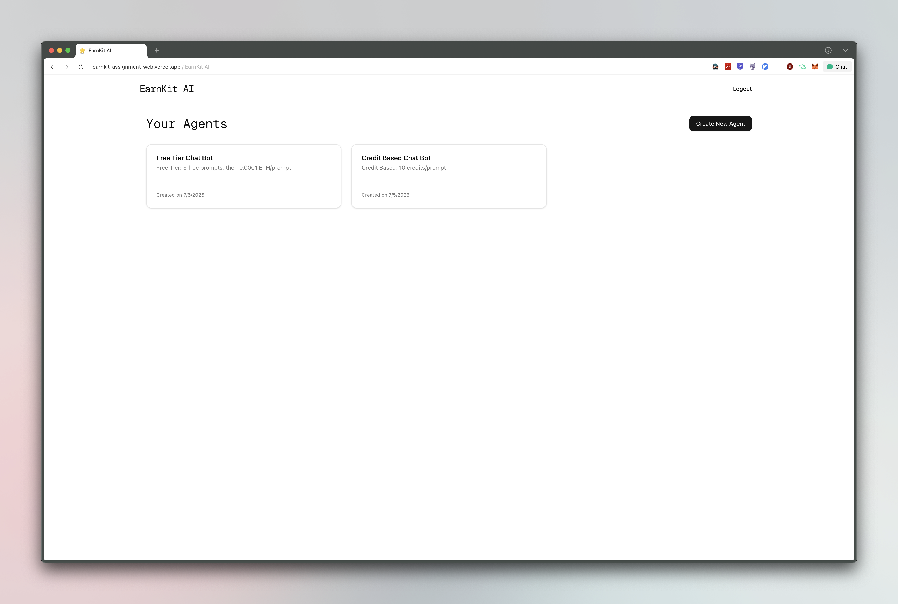
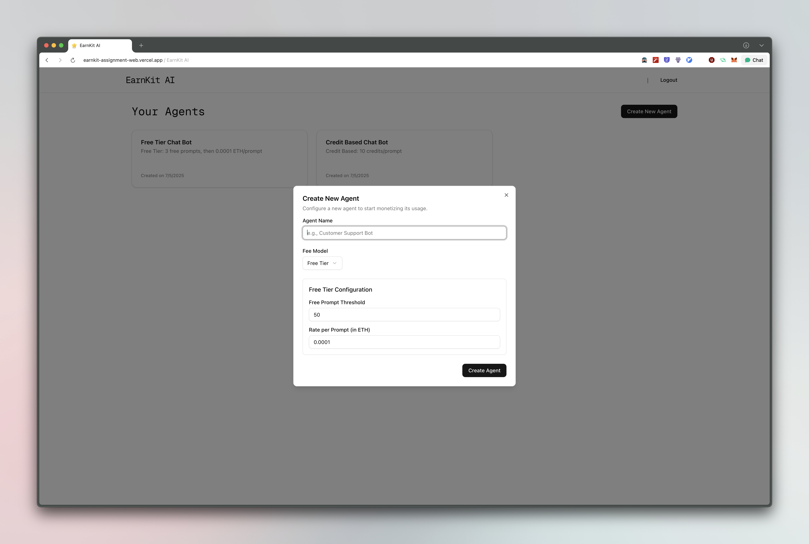
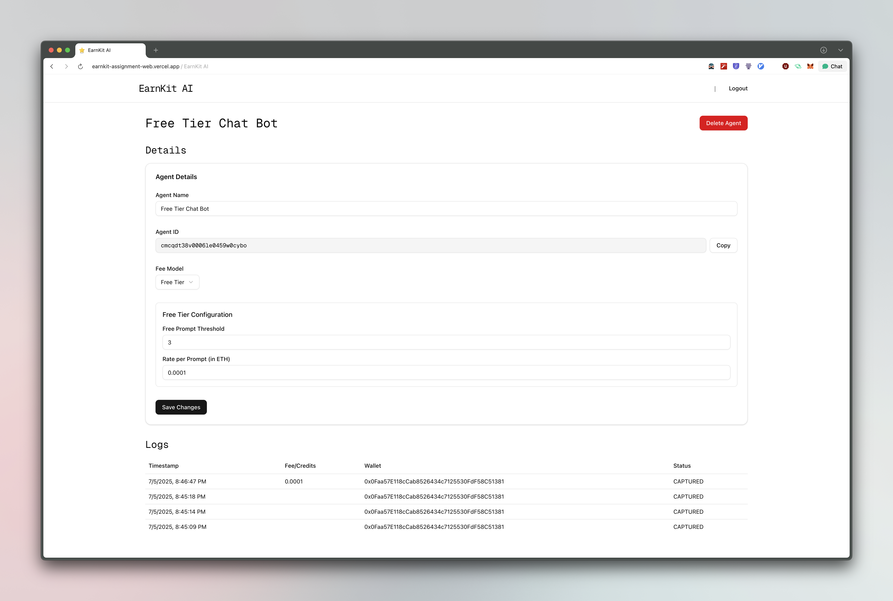
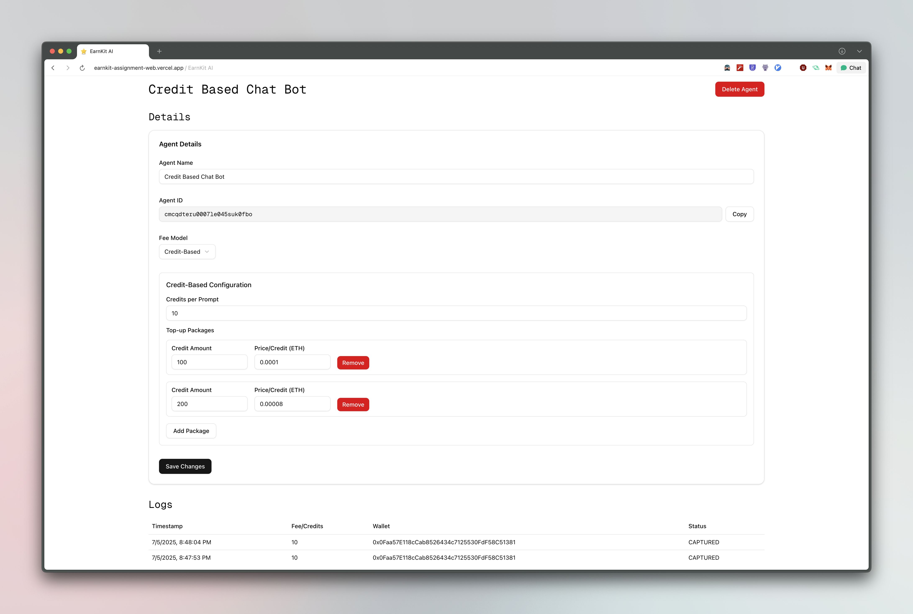
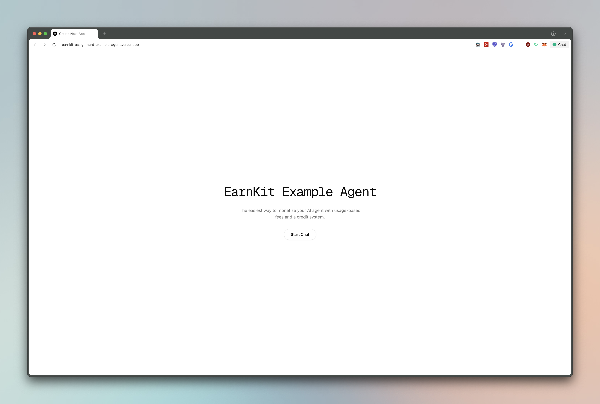
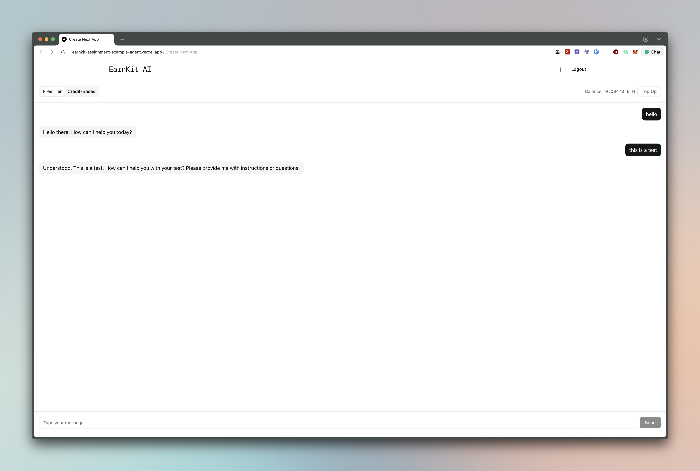
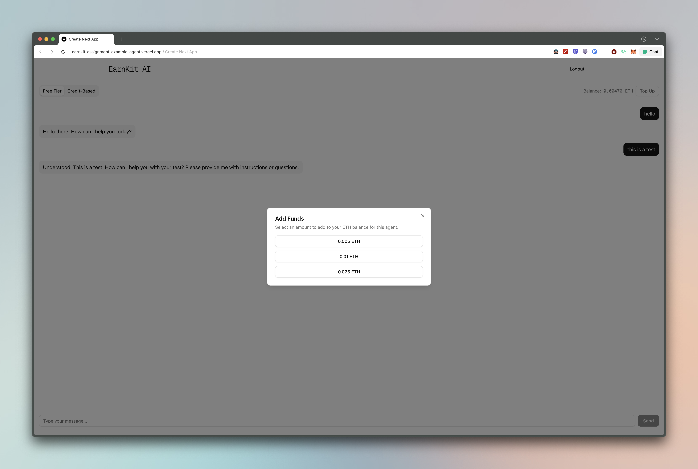
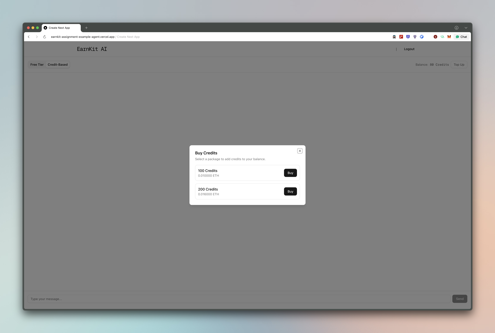

# EarnKit – AI Monetization Platform (Assignment)

This repository contains the full-stack implementation for the EarnKit take-home assignment. It includes a lightweight TypeScript SDK, a robust backend, a developer dashboard, and a live example AI agent, all built within a `pnpm` monorepo.

---

## Live Demo & Links

-   **Developer Dashboard:** **[earnkit-assignment-web.vercel.app](https://earnkit-assignment-web.vercel.app/)**
-   **Example Agent App:** **[earnkit-assignment-example-agent.vercel.app](https://earnkit-assignment-example-agent.vercel.app/)**
-   **Full Documentation:** **[View the Docs](https://earnkit-assignment-web.vercel.app/docs)**
-   **SDK:** **[View the SDK](https://github.com/rayvego/earnkit-assignment/tree/main/packages/earnkit-sdk/src)**
-   **Video Demo:** **[View the Video](https://www.youtube.com/watch?v=n9J55u1sCag)**

---

## Features

A brief overview of the key features implemented in this project.

-   **TypeScript SDK (`earnkit-sdk`):** A lightweight, dependency-free SDK for easy integration into any AI agent.
-   **Developer Dashboard (`apps/web`):** A Next.js application for managing agents, configuring fee models, and viewing usage logs.
-   **Example AI Agent (`apps/example-agent`):** A live chat application demonstrating both Free Tier and Credit-Based monetization models using the SDK.
-   **Hybrid Billing System:** A robust backend that handles off-chain micro-transactions and on-chain top-ups.
-   **Secure & Performant API:** Built with Next.js, Prisma, and PostgreSQL, with features like atomic transactions and query optimization.
-   **Wallet Integration:** Seamlessly connects with user wallets via Privy for payments on the Base Sepolia testnet.

## Working and Flow

## Screenshots

## Tech Stack

-   **Framework:** Next.js 15 (App Router)
-   **Language:** TypeScript
-   **Monorepo:** pnpm Workspaces
-   **Database:** Vercel Postgres with Prisma ORM
-   **Styling:** Tailwind CSS & shadcn/ui
-   **Authentication:** Privy
-   **Deployment:** Vercel

## Full Documentation

For detailed information on the architecture, design decisions, local setup, and a complete SDK reference, please visit the **[full documentation site](https://earnkit-assignment-web.vercel.app/docs)**.